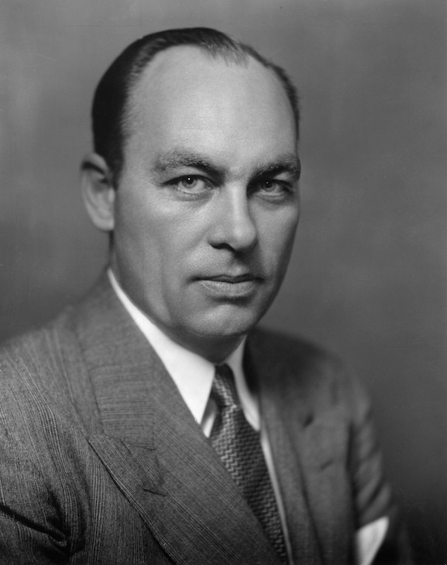

The picture above is of George Gallup. Gallup is considered to be the father of public opinion polling and founded the namesake polling organization, Gallup. Since Gallup revolutionized polling, it has been a mainstay when talking about elections. Although polls are widely conducted and a focal point of campaign news, the validity and accuracy of polls has always been in question. In the 1948 election, polls famously predicted a Dewey victory over Truman and more recently some polls underestimated the support for Trump in the 2016 election. These polling mishaps lead to one essential question: What makes a good poll?

## 538 Pollster Ratings

538 attempts to answer the question by giving each poll that it includes in its aggregation a [rating](https://projects.fivethirtyeight.com/pollster-ratings/). In the past this rating was on a scale from A+ to D-, but now the rating is on a scale from 0 to 3. According to 538's [website](https://fivethirtyeight.com/methodology/how-our-pollster-ratings-work/) the rating takes into account several factors

* Simple error for polls (i.e., how far away the poll results are from the actual election margin).
* How well other pollsters performed in the same races (i.e., whether this pollster is as good as, better than or worse than others).
* Methodological quality (i.e., whether this pollster is conducting polls in accordance with professional standards).
* Herding (i.e., whether this pollster appears to just be copying others’ results).

## Evaluating the Ratings

Utilizing polls from the 2016 and 2020 election cycle (before the numeric pollster ratings) I analyzed the difference in polling ratings. For the analysis, I grouped the pollster ratings into three categories: A (A+, A, and A-), B (B+, B, and B-), and C (C+, C, and C-).

The first observation from this analysis is the large number of C rated polls compared to A and B rated polls. There are almost 1000 more polls in the C range than the A and B range. C polls also stand out on sample size. The mean sample size of C polls is 4x the mean of A polls. C polls also seem to have a more Democratic tilt, as they predict Democratic support 4 points higher than A and B polls on average. Lastly, C polls appear more prone to outliers as they have both a poll with a sample size of 88 and one with a 94% prediction.

Pollster Rating | Number of Polls | Mean Sample Size | Max Sample Size | Min Sample Size | Mean DEM prediction | Max Dem Prediction | Min Dem Prediction
------------- | ------------- | ------------- | ------------- | ------------- | ------------- | ------------- | -------------
A | 2783 | 1122 | 5459 | 301 | 46.45 | 69.44 | 34.00
B | 2323 | 2722 | 71789 | 201 | 46.12 | 64.00 | 20.00
C | 3643 | 5043 | 42858 | 88 | 50.39 | 94.00 | 21.48

Additionally, in an attempt to see accuracy over time, I plotted the average poll prediction for Democratic candidates. The dotted line represents the actual election outcome. Although the C polls have more range, they seem to get closer to the actual prediction as the election date is closer

Note: The dotted line is a sum of the 2016 and 2020 election since the dataset covers the 2016 and 2020 elections

}}index_files/figure-html/unnamed-chunk-4-1.png" width="672" />

## Predicting Based on the Ratings

Lastly, I used the A, B, and C polls to predict the 2024 election to see if there is any difference in the predictions. Before fitting the model, I subset it to only predictions for the Democratic party. Then I fit the model using the projected Democratic vote share and the actual election outcome in either 2016 or 2020. Lastly, I used 2024 polling data to predict based on the model. In future analysis, I would include older polls to have more data points; however, I was unable to find older polling data with the associated 538 pollster ratings.

Model | Predicted DEM Vote | R-squared
------------- | ------------- | -------------
A | 49.15% | 0.2853
B | 50.65% | 0.0004535
C | 50.53% | 0.06187

Ultimately, all of the models had pretty low R-squared values which means that they explain little of the variance in the data. However, the A prediction model had the best R-squared. The models also gave similar predictions and the B model gave the most support to Democrats. When all the models are combined, they predict that Democrats will capture __50.1%__ of the vote in the 2024 election. According to my analysis, there is little variation in the prediction based on pollster ratings. However, the higher R-squared leads me to believe that A polls are better than lower rated ones.

