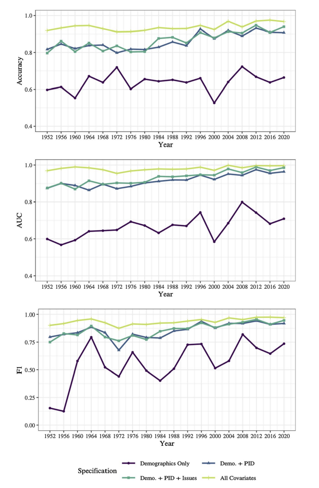

Demographics and election prediction go hand-in-hand. Demographics refers to statistics about the population (Ex: Gender, Race, Age). Understanding demographics, their voting patterns, and predicting their turnout are key to an election outcome as a shift in key demographics have been the deciding factor in many elections. In the 1920 Presidential election, [Warren G. Harding won the presidency](https://www.womenshistory.org/articles/womens-political-participation-after-1920-myth-and-reality) partially due to the 19th Amendment which introduced a new demographic to the voting population: women. More recently, the 2008 election and 2016 election hinged on high turnout from unlikely demographics. In 2008, [Black voters turned out at a high leve](https://academic.oup.com/poq/article/73/5/995/1868700)l to carry Obama to the White House and in 2016 [large turnout among rural voters](https://www.npr.org/2016/11/14/501737150/rural-voters-played-a-big-part-in-helping-trump-defeat-clinton) catapulted Trump to victory.

Although demographics are a critical part of election prediction they are not everything. In a recent 2022 article, [Seo-young Silvia Kim & Jan Zilinsky](https://link.springer.com/article/10.1007/s11109-022-09816-z) analyzed the predictive power of demographics in elections. The chart below shows the accuracy of demographics alone compared to also including party identification or issue preferences.

```{r echo=FALSE, fig.align='center', out.height="33%", out.width="33%"}
# Adding in image of Kim and Zilinsky demographic prediction


```


The takeaway from the graph and the article is that demographics alone have relatively low predictive power as only around 60% of partisan vote choices were accurately explained by the demographics alone model. However, the graph also shows that demographics are still useful when combined with other variables. So, how do demographics look in the 2024 election and what effect might they have?

## Analyzing the Voterfile

Although it is impossible to know the demographics of voters before the election occurs, there are some tools that we can use to predict to the demographics of the election. One of the tools are lists of registered voters in each state. Although all registered voters will not turnout and some voters will register on election day, the lists give a good hint of potential demographics. Using these lists of registered voters, I will analyze a few demographics: Age, Married, Renters / Homeowners


```{r warning=FALSE, include=FALSE}

# Load in libraries
library(car)
library(caret)
library(CVXR)
library(foreign)
library(glmnet)
library(haven)
library(janitor)
library(kableExtra)
library(maps)
library(mlr3)
library(randomForest)
library(ranger)
library(RColorBrewer)
library(sf)
library(tidyverse)
library(viridis)


# Voterfile

# Loading in 1% voterfile
voterfile.sample.files <- list.files("state_1pc_samples_aug24")

# Making one voterfile dataset
voterfile.complete <- read_csv(paste0("state_1pc_samples_aug24/", voterfile.sample.files[1]))
for (i in 2:length(voterfile.sample.files)) {
  temp <- read_csv(paste0("state_1pc_samples_aug24/",voterfile.sample.files[i]))
  voterfile.complete <- rbind(voterfile.complete, temp)
}

# Analyzing homeownership in swing states (AZ, PA, GA, NV, MI, NC, WI) 


## Recodes homeownership on a 0-2 scale ~ 1 is renters, 2 is homeowners
voterfile.complete <- voterfile.complete %>% mutate(sii_homeowner=case_when(sii_homeowner == "H" ~ 2, sii_homeowner == "R" ~ 1, TRUE ~ 0)) 

#N.B. This section is repetitive for each state as I couldn't figure out a for loop
# Arizona (Repeats for each swing state; couldn't figure out a for loop)

# Homeowners and first-time voters
vf_az_subset_renters <- subset(voterfile.complete, voterfile.complete$svi_vote_all_general_pres == 0 & voterfile.complete$sii_homeowner == 1 & voterfile.complete$sii_deceased == 0 & voterfile.complete$sii_state == "AZ")

# Subset to see how many renters and first time voters
vf_az_subset_homeowners <- subset(voterfile.complete, voterfile.complete$svi_vote_all_general_pres == 0 & voterfile.complete$sii_homeowner == 2 & voterfile.complete$sii_deceased == 0 & voterfile.complete$sii_state == "AZ")

# number of first time renters voters
az_percent_homeowners <- count(vf_az_subset_homeowners) / count(voterfile.complete[voterfile.complete$sii_state == "AZ", ])
az_percent_renters <- count(vf_az_subset_renters) / count(voterfile.complete[voterfile.complete$sii_state == "AZ", ])

# Pennsylvania

# Homeowners and first-time voters
vf_pa_subset_renters <- subset(voterfile.complete, voterfile.complete$svi_vote_all_general_pres == 0 & voterfile.complete$sii_homeowner == 1 & voterfile.complete$sii_deceased == 0 & voterfile.complete$sii_state == "PA")

# Subset to see how many renters and first time voters
vf_pa_subset_homeowners <- subset(voterfile.complete, voterfile.complete$svi_vote_all_general_pres == 0 & voterfile.complete$sii_homeowner == 2 & voterfile.complete$sii_deceased == 0 & voterfile.complete$sii_state == "PA")

# number of first time renters voters
pa_percent_homeowners <- count(vf_pa_subset_homeowners) / count(voterfile.complete[voterfile.complete$sii_state == "PA", ])
pa_percent_renters <- count(vf_pa_subset_renters) / count(voterfile.complete[voterfile.complete$sii_state == "PA", ])

# Georgia

# Homeowners and first-time voters
vf_ga_subset_renters <- subset(voterfile.complete, voterfile.complete$svi_vote_all_general_pres == 0 & voterfile.complete$sii_homeowner == 1 & voterfile.complete$sii_deceased == 0 & voterfile.complete$sii_state == "GA")

# Subset to see how many renters and first time voters
vf_ga_subset_homeowners <- subset(voterfile.complete, voterfile.complete$svi_vote_all_general_pres == 0 & voterfile.complete$sii_homeowner == 2 & voterfile.complete$sii_deceased == 0 & voterfile.complete$sii_state == "GA")

# number of first time renters voters
ga_percent_homeowners <- count(vf_ga_subset_homeowners) / count(voterfile.complete[voterfile.complete$sii_state == "GA", ])
ga_percent_renters <- count(vf_ga_subset_renters) / count(voterfile.complete[voterfile.complete$sii_state == "GA", ])

# Nevada

# Homeowners and first-time voters
vf_nv_subset_renters <- subset(voterfile.complete, voterfile.complete$svi_vote_all_general_pres == 0 & voterfile.complete$sii_homeowner == 1 & voterfile.complete$sii_deceased == 0 & voterfile.complete$sii_state == "NV")

# Subset to see how many renters and first time voters
vf_nv_subset_homeowners <- subset(voterfile.complete, voterfile.complete$svi_vote_all_general_pres == 0 & voterfile.complete$sii_homeowner == 2 & voterfile.complete$sii_deceased == 0 & voterfile.complete$sii_state == "NV")

# number of first time renters voters
nv_percent_homeowners <- count(vf_nv_subset_homeowners) / count(voterfile.complete[voterfile.complete$sii_state == "NV", ])
nv_percent_renters <- count(vf_nv_subset_renters) / count(voterfile.complete[voterfile.complete$sii_state == "NV", ])

# Michigan

# Homeowners and first-time voters
vf_mi_subset_renters <- subset(voterfile.complete, voterfile.complete$svi_vote_all_general_pres == 0 & voterfile.complete$sii_homeowner == 1 & voterfile.complete$sii_deceased == 0 & voterfile.complete$sii_state == "MI")

# Subset to see how many renters and first time voters
vf_mi_subset_homeowners <- subset(voterfile.complete, voterfile.complete$svi_vote_all_general_pres == 0 & voterfile.complete$sii_homeowner == 2 & voterfile.complete$sii_deceased == 0 & voterfile.complete$sii_state == "MI")

# number of first time renters voters
mi_percent_homeowners <- count(vf_mi_subset_homeowners) / count(voterfile.complete[voterfile.complete$sii_state == "MI", ])
mi_percent_renters <- count(vf_mi_subset_renters) / count(voterfile.complete[voterfile.complete$sii_state == "MI", ])

# North Carolina

# Homeowners and first-time voters
vf_nc_subset_renters <- subset(voterfile.complete, voterfile.complete$svi_vote_all_general_pres == 0 & voterfile.complete$sii_homeowner == 1 & voterfile.complete$sii_deceased == 0 & voterfile.complete$sii_state == "NC")

# Subset to see how many renters and first time voters
vf_nc_subset_homeowners <- subset(voterfile.complete, voterfile.complete$svi_vote_all_general_pres == 0 & voterfile.complete$sii_homeowner == 2 & voterfile.complete$sii_deceased == 0 & voterfile.complete$sii_state == "NC")

# number of first time renters voters
nc_percent_homeowners <- count(vf_nc_subset_homeowners) / count(voterfile.complete[voterfile.complete$sii_state == "NC", ])
nc_percent_renters <- count(vf_nc_subset_renters) / count(voterfile.complete[voterfile.complete$sii_state == "NC", ])

# Wisconsin

# Homeowners and first-time voters
vf_wi_subset_renters <- subset(voterfile.complete, voterfile.complete$svi_vote_all_general_pres == 0 & voterfile.complete$sii_homeowner == 1 & voterfile.complete$sii_deceased == 0 & voterfile.complete$sii_state == "WI")

# Subset to see how many renters and first time voters
vf_wi_subset_homeowners <- subset(voterfile.complete, voterfile.complete$svi_vote_all_general_pres == 0 & voterfile.complete$sii_homeowner == 2 & voterfile.complete$sii_deceased == 0 & voterfile.complete$sii_state == "WI")

# number of first time renters voters
wi_percent_homeowners <- count(vf_wi_subset_homeowners) / count(voterfile.complete[voterfile.complete$sii_state == "WI", ])
wi_percent_renters <- count(vf_wi_subset_renters) / count(voterfile.complete[voterfile.complete$sii_state == "WI", ])


# Create table to get other demographics (Age and Marriage)

age_marraiage_voterstats  <- voterfile.complete %>%
     group_by(sii_state) %>%
     summarize(mean_age = mean(sii_age, na.rm = TRUE), mean_married = mean(sii_married, na.rm = TRUE))


# Get the states map
states_map <- map_data("state")


# Creating voterfile statistics dataset to merge onto states map (I decided to hard code the variables because I wanted to see ever state on the map)
voterfile_stats <- data.frame(region = c("alabama", "arizona", "arkansas", "california", "colorado", "connecticut", "delaware", "florida", "georgia", "idaho", "illinois", "indiana", "iowa", "kansas", "kentucky", "louisiana", "maine", "maryland", "massachusetts", "michigan", "minnesota", "mississippi", "missouri", "montana", "nebraska", "nevada", "new hampshire", "new jersey", "new mexico", "new york", "north carolina", "north dakota", "ohio", "oklahoma", "oregon", "pennsylvania", "rhode island", "south carolina", "south dakota", "tennessee", "texas", "utah", "vermont", "virginia", "washington", "west virginia", "wisconsin", "wyoming"), percent_renters = c(0, 6.32, 0, 0, 0, 0, 0, 0, 4.55, 0, 0, 0, 0, 0, 0, 0, 0, 0, 0, 3.28, 0, 0, 0, 0, 0, 72.2, 0, 0, 0, 0, 3.86, 0, 0, 0, 0, 3.33, 0, 0, 0, 0, 0, 0, 0, 0, 0, 0, 1.71, 0), percent_homeowners = c(0, 21.1, 0, 0, 0, 0, 0, 0, 21.4, 0, 0, 0, 0, 0, 0, 0, 0, 0, 0, 21.4, 0, 0, 0, 0, 0, 23.2, 0, 0, 0, 0, 18.8, 0, 0, 0, 0, 21.5, 0, 0, 0, 0, 0, 0, 0, 0, 0, 0, 10.7, 0), age = c(51.49048, 52.12933, 51.46218, 51.20815, 48.76015, 52.78880, 53.75013, 53.12383, 49.11917, 51.34345, 53.09734, 51.55012, 51.70926, 51.91467, 51.72577, 51.31758, 51.36451, 51.49227, 54.27671, 51.27594, 52.29159, 51.04434, 57.96184, 52.55765, 50.26209, 58.67459, 51.57028, 58.87460, 51.66325, 52.37447, 49.55601, 52.23367, 52.11677, 52.01195, 50.74921, 52.42373, 51.24957, 52.94089, 57.14923, 51.59457, 49.26600, 50.81513, 50.29708, 52.96750, 51.09090, 61.30506, 52.15955, 57.95986), marriage = c(0.4540023, 0.4238810, 0.3750152, 0.3609961, 0.4221279, 0.4108384, 0.4194033, 0.3963197, 0.4210343, 0.5021192, 0.5326135, 0.4307386, 0.4718467, 0.4920653, 0.4640893, 0.4236982, 0.4157751, 0.4119058, 0.4098767, 0.4725696, 0.4801542, 0.4568782, 0.2946830, 0.4302688, 0.4302920, 0.3770987, 0.4865582, 0.3912576, 0.3989679, 0.3633983, 0.3205606, 0.3569513, 0.4526876, 0.4156086, 0.3695071, 0.4358748, 0.3863302, 0.4904684, 0.3694812, 0.4554652, 0.4176023, 0.4085672, 0.4426213, 0.3897506, 0.4114707, 0.3471870, 0.4410438, 0.3466135))

# Merge onto states_map
voterstats_map <- merge(states_map, voterfile_stats, by = "region")

# Maps of Demographics
my_custom_theme <- 
  theme_light() + 
  theme(panel.border = element_blank(),
        plot.title = element_text(size = 15, hjust = 0.5), 
        axis.text = element_blank(),
        strip.text = element_text(size = 18),
        legend.title = element_text(size = 8),
        legend.text = element_text(size = 7),
        text = element_text(family = "Georgia"),
        axis.line = element_blank(), 
        axis.ticks = element_blank(), 
        axis.title = element_blank())

```


#### Age

The map below shows the average age of registered voters in each state. Although the range is relatively small as it goes from 50 to 65, there are still some interesting comparative insights. The swing states of Nevada, Georgia, and North Carolina standout. Nevada has one of the oldest voting populations in the U.S., but Georgia and North Carolina have some of the youngest in the country. Understanding voting preferences of the elderly and youth appear to be critical in predicitng the election outcome in these states.

```{r echo=FALSE, warning=FALSE}
# Map of Age of Registered Voters
voterstats_map |> 
     ggplot(aes(long, lat, group = group)) + 
     geom_polygon(aes(fill = age)) + scale_fill_gradient(name = "Age", low = "white", high = "lightblue", na.value = NA,) + my_custom_theme + theme(panel.background = element_rect(fill = "lightgrey"))


```


#### Married

The map below shows the percent of registered voters in each state that are married. North Carolina once again stands out as it has one of the highest percentage of single voters in the nation. This could hint that the candidate that better addresses issues that are critical to single voters could win the swing state.
``` {r echo=FALSE, warning=FALSE}
# Map of Married Registered Voters
voterstats_map |> 
     ggplot(aes(long, lat, group = group)) + 
     geom_polygon(aes(fill = marriage)) + scale_fill_gradient(name = "% Married", low = "white", high = "lightblue", na.value = NA,) + my_custom_theme + theme(panel.background = element_rect(fill = "lightgrey"))


```


#### Renters / Homeowners

``` {r echo=FALSE, warning=FALSE}
# Map of % of First-Time voters who are renters or homeowners
voterstats_map |> 
     ggplot(aes(long, lat, group = group)) + 
     geom_polygon(aes(fill = percent_renters + percent_homeowners)) + scale_colour_manual(values = c(0:100)) + scale_fill_gradient(name = "% First-Time Voters Renters or Homeowners", low = "white", high = "red", na.value = NA) + my_custom_theme + theme(panel.background = element_rect(fill = "lightgrey"))


```


## Analyzing New Prediction Model

```{r warning=FALSE, include=FALSE}
d_popvote <- read_csv("popvote_1948_2020.csv")
d_fred <- read_csv("fred_econ copy.csv")
d_fred$sp500move <- d_fred$sp500_high - d_fred$sp500_low
d_fred_housing <- read_csv("fred_housing.csv")

fundamentals <- d_popvote |> 
  filter(incumbent_party == TRUE) |> 
  select(year, pv, pv2p, winner) |> 
  left_join(d_fred |> filter(quarter == 2)) |> 
  left_join(d_fred_housing |> filter(quarter == 2))


# Training set with 2020
fund_train <- fundamentals |> 
  filter(year < 2024 & year > 1952)
# Training set without 2020
fund_train_2 <- fundamentals |> 
  filter(year < 2024 & year > 1952 & year != 2020)
fund_test <- fundamentals |> 
  filter(year == 2024)

# With 2020
fund_model <- lm(pv2p ~ GDP_growth_quarterly + sp500move + CPI + homeowner_vacancy + rental_vacancy, data = fund_train)
summary(fund_model)

fund.predict <- predict(fund_model, fund_test)

# Without 2020
fund_model_2 <- lm(pv2p ~ GDP_growth_quarterly + sp500move + CPI + homeowner_vacancy + rental_vacancy, data = fund_train_2)
summary(fund_model_2)

fund2.predict <- predict(fund_model_2, fund_test)


# Polling Data Based Prediction

polling <- read_csv("national_polls_1968-2024 copy.csv")

# Adjust popular vote dataset for merging
d_popvote$party[d_popvote$party == "democrat"] <- "DEM"
d_popvote$party[d_popvote$party == "republican"] <- "REP"

# Create dataset of polling average by week until the election. 
d_poll_weeks <- polling |> 
  group_by(year, party, weeks_left) |>
  summarize(mean_poll_week = mean(poll_support)) |> 
  filter(weeks_left <= 30 & party == "DEM") |> 
  pivot_wider(names_from = weeks_left, values_from = mean_poll_week) |> 
  left_join(d_popvote, by = c("year", "party"))
 
# Split into training and testing data based on inclusion or exclusion of 2024. 
d_poll_weeks_train <- d_poll_weeks |> 
  filter(year <= 2020)
d_poll_weeks_test <- d_poll_weeks |> 
  filter(year == 2024)

# Extra training set without 2016 and 2020 (Removing years that the polling "went wrong")
d_poll_weeks_train2 <- d_poll_weeks |> 
  filter(year <= 2012)

colnames(d_poll_weeks)[3:33] <- paste0("poll_weeks_left_", 0:30)
colnames(d_poll_weeks_train)[3:33] <- paste0("poll_weeks_left_", 0:30)
colnames(d_poll_weeks_train2)[3:33] <- paste0("poll_weeks_left_", 0:30)
colnames(d_poll_weeks_test)[3:33] <- paste0("poll_weeks_left_", 0:30)

# Normal training and testing
x.train <- d_poll_weeks_train |>
  ungroup() |> 
  select(all_of(paste0("poll_weeks_left_", 7:30))) |> 
  as.matrix()
y.train <- d_poll_weeks_train$pv2p
x.test <- d_poll_weeks_test |>
  ungroup() |> 
  select(all_of(paste0("poll_weeks_left_", 7:30))) |> 
  as.matrix()

# Training without 2016 and 2020
x.train2 <- d_poll_weeks_train2 |>
  ungroup() |> 
  select(all_of(paste0("poll_weeks_left_", 7:30))) |> 
  as.matrix()
y.train2 <- d_poll_weeks_train2$pv2p

# Using elastic-net for normal poll predictions
set.seed(02138)
enet.poll <- cv.glmnet(x = x.train, y = y.train, alpha = 0.5)
lambda.min.enet.poll <- enet.poll$lambda.min

# Predict 2024 national pv2p share
poll.predict <- (predict(enet.poll, s = lambda.min.enet.poll, newx = x.test))


# Predicting with excluded data
set.seed(02138)
enet.poll2 <- cv.glmnet(x = x.train2, y = y.train2, alpha = 0.5)
lambda.min.enet.poll2 <- enet.poll2$lambda.min

# Predict 2024 national pv2p share using elastic-net. 
poll.predict2 <- (predict(enet.poll2, s = lambda.min.enet.poll2, newx = x.test))

# Ensemble Prediction
ensemble_with_all <- (fund.predict * 2/3 + poll.predict * 1/3)
ensemble_without_outliers <- (fund2.predict * 2/3 + poll.predict2 * 1/3)
```


