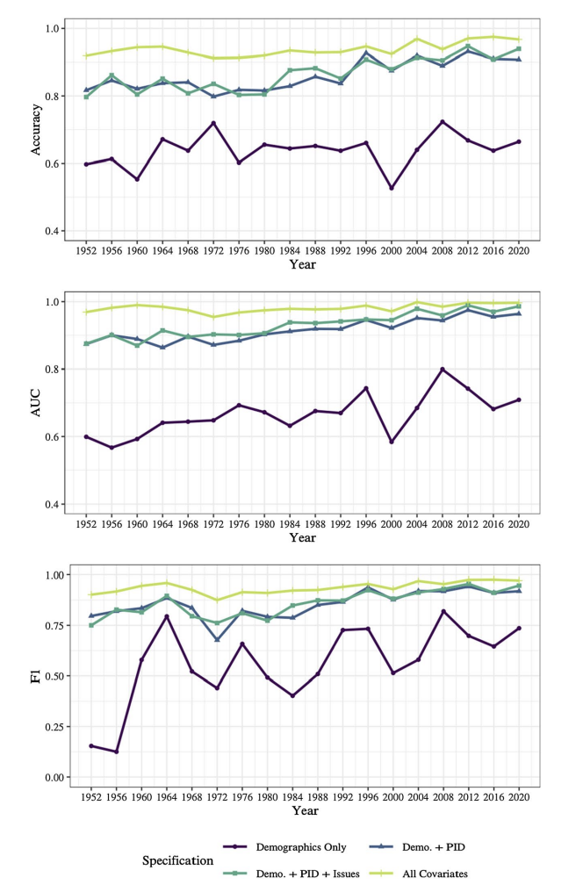

Demographics and election prediction go hand-in-hand. Demographics refers to statistics about the population (Ex: Gender, Race, Age). Understanding demographics, their voting patterns, and predicting their turnout are key to an election outcome as a shift in key demographics have been the deciding factor in many elections. In the 1920 Presidential election, [Warren G. Harding won the presidency](https://www.womenshistory.org/articles/womens-political-participation-after-1920-myth-and-reality) partially due to the 19th Amendment which introduced a new demographic to the voting population: women. More recently, the 2008 election and 2016 election hinged on high turnout from unlikely demographics. In 2008, [Black voters turned out at a high leve](https://academic.oup.com/poq/article/73/5/995/1868700)l to carry Obama to the White House and in 2016 [large turnout among rural voters](https://www.npr.org/2016/11/14/501737150/rural-voters-played-a-big-part-in-helping-trump-defeat-clinton) catapulted Trump to victory.

Although demographics are a critical part of election prediction they are not everything. In a recent 2022 article, [Seo-young Silvia Kim & Jan Zilinsky](https://link.springer.com/article/10.1007/s11109-022-09816-z) analyzed the predictive power of demographics in elections. The chart below shows the accuracy of demographics alone compared to also including party identification or issue preferences.

The takeaway from the graph and the article is that demographics alone have relatively low predictive power as only around 60% of partisan vote choices were accurately explained by the demographics alone model. However, the graph also shows that demographics are still useful when combined with other variables. So, how do demographics look in the 2024 election and what effect might they have?

## Analyzing the Voterfile

Although it is impossible to know the demographics of voters before the election occurs, there are some tools that we can use to predict to the demographics of the election. One of the tools are lists of registered voters in each state. Although all registered voters will not turnout and some voters will register on election day, the lists give a good hint of potential demographics. Using these lists of registered voters, I will analyze a few demographics: Age, Married, Renters / Homeowners

#### Age

The map below shows the average age of registered voters in each state. Although the range is relatively small as it goes from 50 to 65, there are still some interesting comparative insights. The swing states of Nevada, Georgia, and North Carolina standout. Nevada has one of the oldest voting populations in the U.S., but Georgia and North Carolina have some of the youngest in the country. Understanding voting preferences of the elderly and youth appear to be critical in predicitng the election outcome in these states.

}}index_files/figure-html/unnamed-chunk-3-1.png" width="672" />

#### Married

The map below shows the percent of registered voters in each state that are married. North Carolina once again stands out as it has one of the highest percentage of single voters in the nation. This could hint that the candidate that better addresses issues that are critical to single voters could win the swing state.
}}index_files/figure-html/unnamed-chunk-4-1.png" width="672" />

#### Renters / Homeowners

}}index_files/figure-html/unnamed-chunk-5-1.png" width="672" />

## Analyzing New Prediction Model

