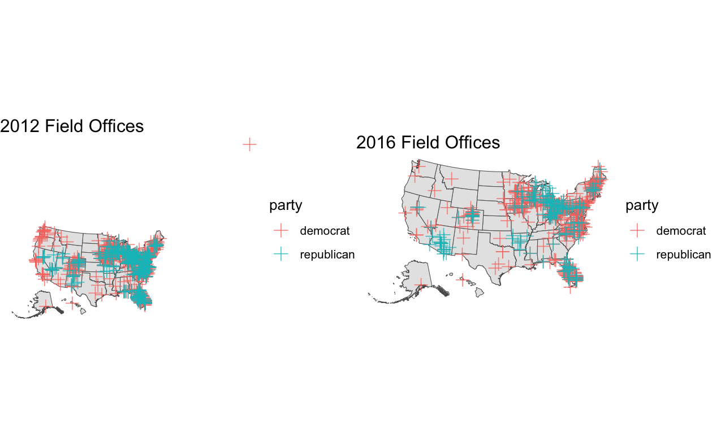

After discussing the air game part of campaigns last week, I will spend time discussing the ground game this week. While the air game focuses on advertisements, the ground games focuses on human capital. Campaigns mobilize a large number of volunteers to canvass as part of their Get Out the Vote (GOTV) strategy. Similar to the air game, the ground game is focused less on persuading voters but instead on increasing turnout of likely voters.

```{r include=FALSE}
library(geofacet)
library(ggpubr)
library(ggthemes)
library(haven)
library(kableExtra)
library(maps)
library(mgcv)
library(mgcViz)
library(RColorBrewer)
library(scales)
library(sf)
library(spData)
library(stargazer)
library(tidygeocoder)
library(tidyverse)
library(tigris)
library(tmap)
library(tmaptools)
library(viridis)
library(usmap)

# Read in popular vote dataset
d_popvote <- read_csv("popvote_1948_2020.csv")
d_state_popvote <- read_csv("state_popvote_1948_2020.csv")
d_state_popvote[d_state_popvote$state == "District of Columbia",]$state <- "District Of Columbia"


# Read elector distribution dataset. 
d_ec <- read_csv("corrected_ec_1948_2024.csv")

# Read polling data. 
d_polls <- read_csv("national_polls_1968-2024.csv")
d_state_polls <- read_csv("state_polls_1968-2024.csv")

# Read turnout data. 
d_turnout <- read_csv("state_turnout_1980_2022.csv")

# Read county turnout. 
d_county_turnout <- read_csv("county_turnout.csv")

# Read state-level demographics.
d_state_demog <- read_csv("demographics.csv")

# Read county demographics. 
d_county_demog <- read_csv("county_demographics.csv")

# Read campaign events datasets. 
d_campaign_events <- read_csv("campaigns_2016_2024.csv")[,-1]
```

## Field Offices

The first part of the ground game I will analyze is the presence of field offices.


```{r message=FALSE, warning=FALSE, include=FALSE}
fo_add <- read_csv("fieldoffice_2012-2016_byaddress.csv")

obama_2012 <- fo_add |> filter(year == 2012 & candidate == "Obama")
obama_2012_states <- obama_2012 |> group_by(state)
total_obama_field <- count(obama_2012)
obama_field_states <- count(obama_2012_states)
romney_2012 <- fo_add |> filter(year == 2012 & candidate == "Romney")
romney_2012_states <- romney_2012 |> group_by(state)
total_romney_field <- count(romney_2012)
romney_field_states <- count(romney_2012_states)
clinton_2016 <- fo_add |> filter(year == 2016 & candidate == "Clinton")
clinton_2016_states <- clinton_2016 |> group_by(state)
total_clinton_field <- count(clinton_2016)
clinton_field_states <- count(clinton_2016_states)
trump_2016 <- fo_add |> filter(year == 2016 & candidate == "Trump")
trump_2016_states <- trump_2016 |> group_by(state)
total_trump_field <- count(trump_2016)
trump_field_states <- count(trump_2016_states)

# Note: This code works but I commented it out because it take >10 minutes to run. Instead I inserted a JPEG of the output graph
#field_offices_geocoded <- fo_add |> 
    #geocode(city = city, state = state, method = 'osm', lat = latitude , long = longitude)

#us_geo <- states(cb = TRUE) |> 
  #shift_geometry() |> 
  #filter(STUSPS %in% unique(fo_add$state))

#d_field_offices_transformed <- st_as_sf(field_offices_geocoded |> drop_na(), coords = c("longitude...10", "latitude...9"), crs = 4326) |>
    #st_transform(crs = st_crs(us_geo)) |>
   # shift_geometry() |> 
   # st_make_valid()

#field_2012 <- ggplot() +
    #geom_sf(data = us_geo) + 
    #geom_sf(data = d_field_offices_transformed |> filter(year == 2012), aes(color = party), size = 3, #alpha = 0.75, pch = 3) +
    #ggtitle("2012 Field Offices") +
   # theme_void()

#field_2016 <- ggplot() +
    #geom_sf(data = us_geo) + 
    #geom_sf(data = d_field_offices_transformed |> filter(year == 2016), aes(color = party), size = 3, alpha = 0.75, pch = 3) +
   # ggtitle("2016 Field Offices") +
    #theme_void()
```

```{r echo=FALSE, message=FALSE, warning=FALSE}
# Map the field offices locations
#ggarrange(field_2012, field_2016)

# Add in output graph of field office locations

```


## Campaign Events

```{r message=FALSE, warning=FALSE, include=FALSE}
# Visualizing campaign events. 
d_campaign_events$party[d_campaign_events$candidate %in% c("Trump / Pence", "Trump", "Pence", "Trump/Pence", "Vance")] <- "REP"
d_campaign_events$party[d_campaign_events$candidate %in% c("Biden / Harris", "Biden", "Harris", "Biden/Harris", "Walz", "Kaine", "Clinton", "Clinton / Kaine")] <- "DEM"
p.ev.1 <- d_campaign_events |> group_by(date, party) |> summarize(n_events = n(), year) |> filter(year == 2016) |> ggplot(aes(x = date, y = n_events, color = party)) + geom_point() + geom_smooth() + ggtitle("2016") + theme_bw()
p.ev.2 <- d_campaign_events |> group_by(date, party) |> summarize(n_events = n(), year) |> filter(year == 2020) |> ggplot(aes(x = date, y = n_events, color = party)) + geom_point() + geom_smooth() + ggtitle("2020") +  theme_bw()
p.ev.3 <- d_campaign_events |> group_by(date, party) |> summarize(n_events = n(), year) |> filter(year == 2024) |> ggplot(aes(x = date, y = n_events, color = party)) + geom_point() + geom_smooth() + ggtitle("2024") + theme_bw()

```

```{r echo=FALSE, message=FALSE, warning=FALSE}
# Plot the campaign event timelines
ggarrange(p.ev.1, p.ev.2, p.ev.3)

```


```{r include=FALSE}
# Mapping Campaign Events
d_campaign_events <- read_csv("campaign_events_geocoded.csv")
d_campaign_events$party[d_campaign_events$candidate %in% c("Trump / Pence", "Trump", "Pence", "Trump/Pence", "Vance")] <- "REP"
d_campaign_events$party[d_campaign_events$candidate %in% c("Biden / Harris", "Biden", "Harris", "Biden/Harris", "Walz", "Kaine", "Clinton", "Clinton / Kaine")] <- "DEM"

us_geo <- states(cb = TRUE) |> 
  shift_geometry() |> 
  filter(STUSPS %in% unique(fo_add$state))

d_ev_transformed <- st_as_sf(d_campaign_events |> drop_na(), coords = c("longitude", "latitude"), crs = 4326) |>
  st_transform(crs = st_crs(us_geo)) |>
  shift_geometry() |> 
  st_make_valid()

ev16 <- ggplot() +
   geom_sf(data = us_geo) + 
   geom_sf(data = d_ev_transformed |> filter(year == 2016), aes(color = party), size = 3, alpha = 0.75, pch = 3) +
   ggtitle("2016 Campaign Events") +
   theme_void()

ev20 <- ggplot() +
   geom_sf(data = us_geo) + 
   geom_sf(data = d_ev_transformed |> filter(year == 2020), aes(color = party), size = 3, alpha = 0.75, pch = 3) +
   ggtitle("2020 Campaign Events") +
   theme_void()

ev24 <- ggplot() +
   geom_sf(data = us_geo) + 
   geom_sf(data = d_ev_transformed |> filter(year == 2024), aes(color = party), size = 3, alpha = 0.75, pch = 3) +
   ggtitle("2024 Campaign Events") +
   theme_void()
```


```{r echo=FALSE, message=FALSE, warning=FALSE}
# Map the campaing event locations
ggarrange(ev16, ev20, ev24, ncol = 1, nrow = 3)
```

## Electoral College Model


```{r echo=FALSE, message=FALSE, warning=FALSE}

prediction_data <- data.frame(state = c("AL","AK", "AZ", "AR", "CA", "CO", "CT", "DE", "FL", "GA", "HI" , "ID", "IL", "IN", "IA", "KS", "KY", "LA", "ME", "MD","MA", "MI", "MN", "MS", "MO", "MT", "NE", "NV", "NH", "NJ", "NM", "NY", "NC", "ND", "OH", "OK", "OR", "PA", "RI", "SC","SD", "TN","TX", "UT", "VT", "VA", "WA", "WV", "WI", "WY"), value = c(0, 0, NA, 0, 1, 1, 1, 1, 0, NA, 1, 0, 1, 0, 0, 0, 0, 0, 1, 1, 1, NA, 1, 0, 0, 1, 0, NA, 1, 1, 1, 1, NA, 0, 0, 0, 1, NA, 1, 0, 0, 0, 0, 0, 1, 1, 1, 0, NA, 0))


plot_usmap(region = "states", 
           data = prediction_data,
           values = "value",
           color = "white") + scale_fill_gradient(low = "firebrick", high = "steelblue1", na.value = "purple")

```


```{r include=FALSE}
#Arizona Model
arizona_data <- d_state_popvote |> 
  filter(state == "Arizona") |> 
  select(year, D_pv2p) |> 
  left_join(d_state_polls |> filter(state == "Arizona" & party == "DEM"))

arizona_lm <- lm(data = arizona_data, D_pv2p ~ poll_support)

arizona_2024 <- d_state_polls |>
  filter(state == "Arizona" & year == 2024)

arizona_prediction <- mean(predict(arizona_lm, arizona_2024))

#Georgia Model
georgia_data <- d_state_popvote |> 
  filter(state == "Georgia") |> 
  select(year, D_pv2p) |> 
  left_join(d_state_polls |> filter(state == "Georgia" & party == "DEM"))

georgia_lm <- lm(data = georgia_data, D_pv2p ~ poll_support)

georgia_2024 <- d_state_polls |>
  filter(state == "Georgia" & year == 2024)

georgia_prediction <- mean(predict(georgia_lm, georgia_2024))


#Nevada Model
nevada_data <- d_state_popvote |> 
  filter(state == "Nevada") |> 
  select(year, D_pv2p) |> 
  left_join(d_state_polls |> filter(state == "Nevada" & party == "DEM"))

nevada_lm <- lm(data = nevada_data, D_pv2p ~ poll_support)

nevada_2024 <- d_state_polls |>
  filter(state == "Nevada" & year == 2024)

nevada_prediction <- mean(predict(nevada_lm, nevada_2024))

#North Carolina Model
north_carolina_data <- d_state_popvote |> 
  filter(state == "North Carolina") |> 
  select(year, D_pv2p) |> 
  left_join(d_state_polls |> filter(state == "North Carolina" & party == "DEM"))

north_carolina_lm <- lm(data = north_carolina_data, D_pv2p ~ poll_support)

north_carolina_2024 <- d_state_polls |>
  filter(state == "North Carolina" & year == 2024)

north_carolina_prediction <- mean(predict(north_carolina_lm, north_carolina_2024))

#Michigan Model
michigan_data <- d_state_popvote |> 
  filter(state == "Michigan") |> 
  select(year, D_pv2p) |> 
  left_join(d_state_polls |> filter(state == "Michigan" & party == "DEM"))

michigan_lm <- lm(data = michigan_data, D_pv2p ~ poll_support)

michigan_2024 <- d_state_polls |>
  filter(state == "Michigan" & year == 2024)

michigan_prediction <- mean(predict(michigan_lm, michigan_2024))

#Pennsylvania Model

pennsylvania_data <- d_state_popvote |> 
  filter(state == "Pennsylvania") |> 
  select(year, D_pv2p) |> 
  left_join(d_state_polls |> filter(state == "Pennsylvania" & party == "DEM"))

pennsylvania_lm <- lm(data = pennsylvania_data, D_pv2p ~ poll_support)

pennsylvania_2024 <- d_state_polls |>
  filter(state == "Pennsylvania" & year == 2024)

pennsylvania_prediction <- mean(predict(pennsylvania_lm, pennsylvania_2024))

#Wisconsin Model

wisconsin_data <- d_state_popvote |> 
  filter(state == "Wisconsin") |> 
  select(year, D_pv2p) |> 
  left_join(d_state_polls |> filter(state == "Wisconsin" & party == "DEM"))

wisconsin_lm <- lm(data = wisconsin_data, D_pv2p ~ poll_support)

wisconsin_2024 <- d_state_polls |>
  filter(state == "Wisconsin" & year == 2024)

wisconsin_prediction <- mean(predict(wisconsin_lm, wisconsin_2024))


```


```{r}
# Map for final prediction
prediction_data_final <- data.frame(state = c("AL","AK", "AZ", "AR", "CA", "CO", "CT", "DE", "FL", "GA", "HI" , "ID", "IL", "IN", "IA", "KS", "KY", "LA", "ME", "MD","MA", "MI", "MN", "MS", "MO", "MT", "NE", "NV", "NH", "NJ", "NM", "NY", "NC", "ND", "OH", "OK", "OR", "PA", "RI", "SC","SD", "TN","TX", "UT", "VT", "VA", "WA", "WV", "WI", "WY"), value = c(0, 0, 0, 0, 1, 1, 1, 1, 0, 0, 1, 0, 1, 0, 0, 0, 0, 0, 1, 1, 1, 1, 1, 0, 0, 1, 0, 0, 1, 1, 1, 1, 0, 0, 0, 0, 1, 1, 1, 0, 0, 0, 0, 0, 1, 1, 1, 0, 1, 0))


plot_usmap(region = "states", 
           data = prediction_data_final,
           values = "value",
           color = "white") + scale_fill_gradient(low = "firebrick", high = "steelblue1")


```

State | Harris Predicted Two-Party Vote | Trump Predicted Two-Party Vote
------------- | ------------- | -------------
Arizona | 46.8% | 53.2%
Georgia | 48.5% | 51.5%
Michigan | 52.4% | 47.6%
Nevada | 49.2% | 50.8%
North Carolina | 47.0% | 53.0%
Pennsylvania | 52.4% | 47.6%
Wisconsin | 51.8% | 48.2%


