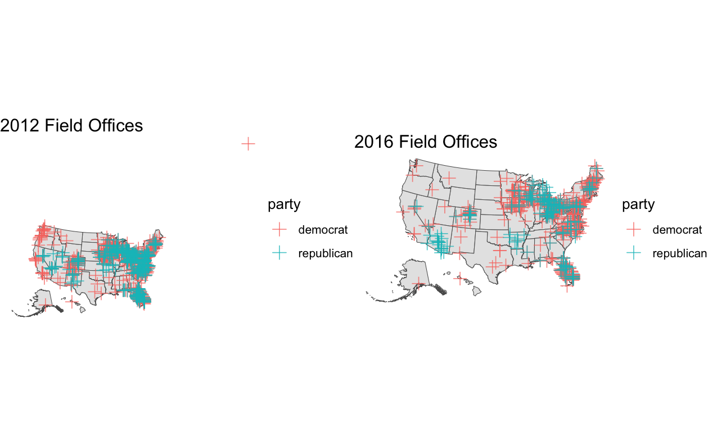

After discussing the air game part of campaigns last week, I will spend time discussing the ground game this week. While the air game focuses on advertisements, the ground games focuses on human capital. Campaigns mobilize a large number of volunteers to canvass as part of their Get Out the Vote (GOTV) strategy. Similar to the air game, the ground game is focused less on persuading voters but instead on increasing turnout of likely voters.

## Field Offices

The first part of the ground game I will analyze is the presence of field offices. Field offices are physical locations that coordinate campaign activies in a locale and can be signs that a campaign views the region as important. In the two maps below, I have plotted the field office locations from the 2012 and 2016 elections. One important thing to note is that the typical party colors are flipped in the maps. One key takeaway from the maps is that Republicans tend to concentrate their offices in a few areas and Democrats spread out their offices including to areas they have little support like Montana and Alaska. In both elections, Democrats spent more resources on field offices as Obama had __791__ compared to Romney's __283__ and Clinton had __538__ compared to Trump's __165__.  

The field office data also disputes the widely accepted conlusion that Hillary Clinton lost in 2016 due to her weak ground game in [Wisconsin and Michigan](https://www.businessinsider.com/why-clinton-lost-michigan-wisconsin-2016-11). Clinton had __40__ and __27__ field offices in Wisconsin and Michigan respectively compared to Trump's __13__ and __22__. Additionally, Trump had less offices in these swing states than Romney in 2012.

Although it is difficult to find complete data on the state of field offices in the 2024 election, it appears hat Democrats will once again have the advantage as [PBS reported in early September](https://www.pbs.org/newshour/politics/harris-and-trump-campaigns-prepare-for-intense-sprint-to-election-day) that Harris had __300__ field offices in swing states while Trump had __100__ offices.

## Campaign Events

Another point of the ground game where 2024 data is accessible is the amount of campaign events. Campaign events include public appearances like rallys, townhalls, and the [occasional McDonald's visit](https://www.nytimes.com/2024/10/20/us/politics/trump-mcdonalds-fries.html). The graphs below show the number of campaign events as the campaign gets closer to election day. The immediate conclusion is that events are more frequent as the election gets closer. Interestingly, this trend hasn't fully taken effect for the 2024 election. One potential explanation for this is the increased threat of politcal violence towards candidates this election cycle.

}}index_files/figure-html/unnamed-chunk-5-1.png" width="672" />

The maps below show the location of campaign events during the 2016, 2020, and 2024 election. The maps are evidence of calcification in politics. In the 2024 election, campaign events have been heavily concentrated in swing states compared to past cycles.

}}index_files/figure-html/unnamed-chunk-7-1.png" width="672" />

## Electoral College Model

This week I decided to switch to Electoral College predictions from the popular vote predictions of the past weeks. In predicting the Electoral College, I think it is only worthwhile to make models for the swing states. After filling in the states that experts deem as safe you get the map below. The seven purple states are considered the swing states. As of right now the Electoral College split would be Harris: 226 and Trump: 219. For prediction purposes, I assume that Maine and Nebraska each give one electoral vote to the party opposite of its popualr vote winner.

}}index_files/figure-html/unnamed-chunk-9-1.png" width="672" />

The prediction model is relatively simple. The model uses historical polling in each state to predict based on the 2024 polling averages.

The individual state models predict a close election with Kamala Harris winning __Michigan, Wisconsin, Pennsylvania__ and Trump winning __Arizona, Georgia, Nevada, North Carolina__. This would result in Harris winning the Electoral College with exactly __270__ votes.

}}index_files/figure-html/unnamed-chunk-12-1.png" width="672" />

Listed below are the predicted two-party vote shares from the state models.

State | Harris Predicted Two-Party Vote | Trump Predicted Two-Party Vote
------------- | ------------- | -------------
Arizona | 46.8% | 53.2%
Georgia | 48.5% | 51.5%
Michigan | 52.4% | 47.6%
Nevada | 49.2% | 50.8%
North Carolina | 47.0% | 53.0%
Pennsylvania | 52.4% | 47.6%
Wisconsin | 51.8% | 48.2%
