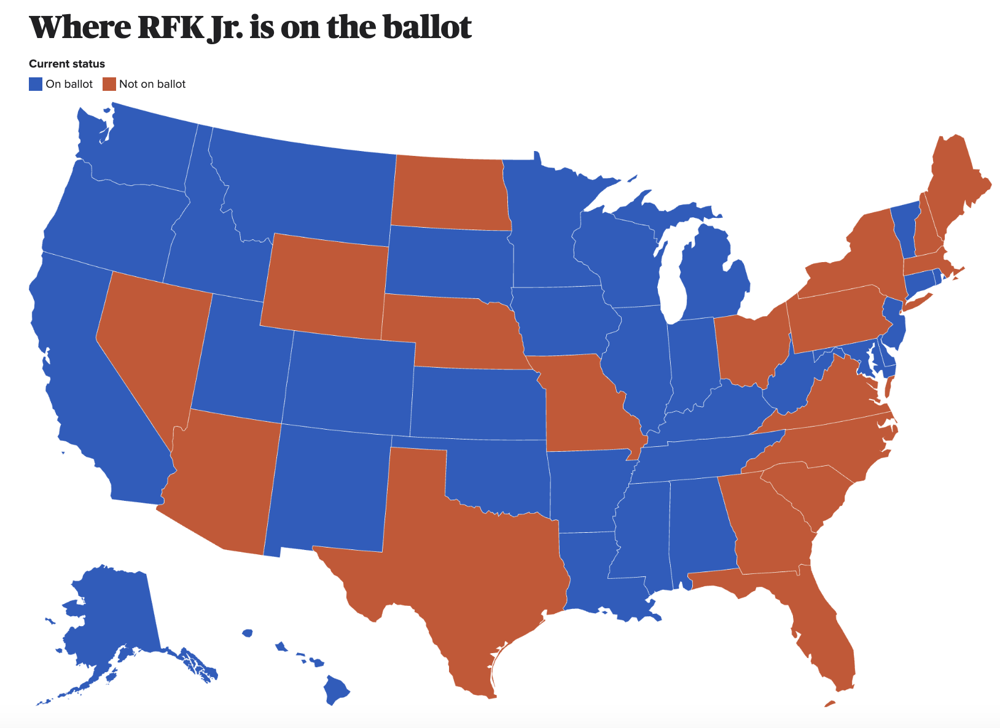
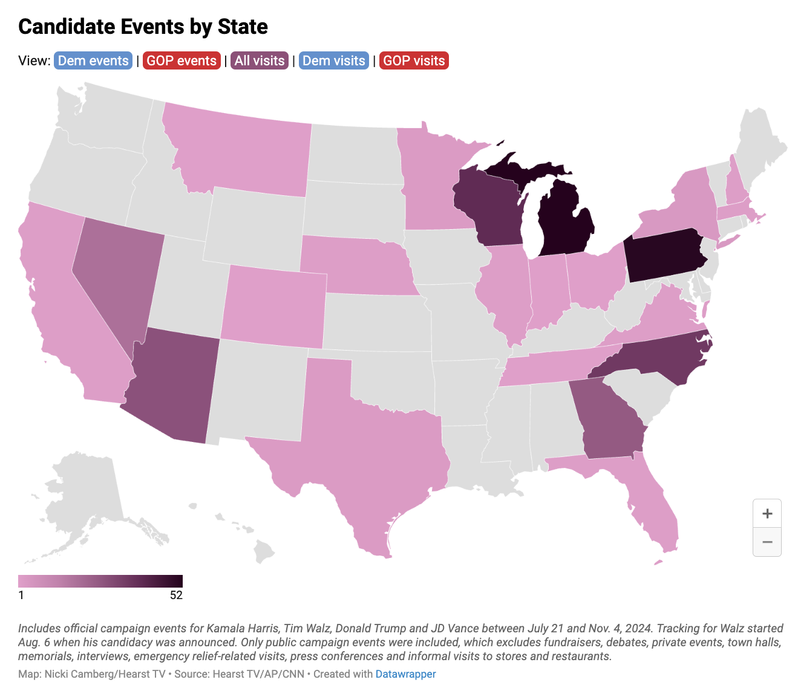

### Overview

```{r echo=FALSE, message=FALSE, warning=FALSE}
# Load packages
library(usmap)

plot_usmap(regions = "counties",
           include = "TN") + labs(title = "Map of Tennessee by County")

```
To conclude my exploration of the 2024 US Presidential Election cycle, I will hone in on one state: Tennessee. The map above shows Tennessee and its 99 counties. The state is usually thought of through its three grand divisions (reflected in the three stars on the state flag). 

The three divisions are West, Middle and East Tennessee. West Tennessee is the most racially diverse of the grand divisions. West Tennessee includes Memphis, the largest city, in the bottom left of the state which is a democratic stronghold. Middle Tennessee includes several wealthy counties and another democratic stronghold in the middle of the state in Nashville. East Tennessee is home to a large rural population and includes the Appalachian Mountains. East Tennessee is also home to the cities of Knoxville and Chattanooga.

According to the recent [census](https://data.census.gov/profile/Tennessee?g=040XX00US47), Tennessee has a population of a little over 7 million. Racial minorities make up about 30% of the state's population with the largest minority group being African-Americans at 16%. Tennessee ranks toward the bottom of the country when it comes to [poverty](https://wisevoter.com/state-rankings/poverty-rate-by-state/) and [educational attainment](https://www.thecentersquare.com/tennessee/tennessee-ranks-among-the-least-educated-states-in-the-country/article_74e83f2f-23cc-5d98-82bb-060897d62c49.html) measurements

```{r echo=FALSE, message=FALSE, warning=FALSE}
plot_usmap(regions = "counties",
           include = "TN",
           data = countypop,
           values = "pop_2022") + labs(title = "Map of Tennessee by County Population (2022 Census Estimates)") +
           theme(legend.position = "right")
```

The map above shows the population of Tennessee's counties using Census 2022 estimates. The map highlights some of the cities mentioned earlier such as Memphis on the left, Nashville in the center, and Knoxville and Chattanooga in the East. 

In the 2024 cycle, Tennessee also featured some notable down ballot races. All nine of Tennessee's US House of Representative seats were up for election. The key down ballot race was for one of Tennessee's two senate seats. The race pitted the incumbent Marsha Blackburn (R) against Gloria Johnson (D). Overall, votes had more choices compared to last Presidential cycle. In [2024](https://www.thinktennessee.org/blog/2024-tennessee-elections-ran-smoothly-with-higher-early-voting-more-contested-races-approved-transit-vote-in-nashville/), 70.4% of races consisted of multiple candidates compared to 51.3% in 2020.


Tennessee's electoral history at the Presidential level is not complicated. The state is considered safely in the Republican column. The state has not been won by a Democrat since 1996 when Bill Clinton won and has not been contested since 2000 when Tennessee native Al Gore was running. In the 2016 and 2020 races, Trump cruised to victory with 60% of the vote.

### State Predictions vs. Outcome
graphic of polling
graphic of acutal outcome by county

```{r}
knitr::include_graphics("tn_election_outcome.png")
```


The state predictions were pretty much spot on
mention not much polling due to not being a swing state
few harris polls vs biden polls

why were they spot on -> state is not a swing state and had the largest vote margin outside of texas and florida (wikipedia)

- another reason is the large early voting which goves bigger smaple size to exit polls

one thing that could have thrown it off
- use RFK map

```{r}

```


- polls did not include RFK in their polling probably due to him removing himself from swing state ballots and the intense focus on polling in swing states

### Campaign

use the wesleyan media project for ad breakdown
mention that it isnt a swing state so no campaign appearance during the direct lead up to 2024

 
```{r}

```
  

  
Harris visited the state as a VP on multiple occasions
- 2022 TSU graduation speech
- Tennesee Three
  - One of them ran for US Senate this cycle
Harris had a close connection as seen by TN DNC delgation being one of first to endorse after Biden dropped

Trump visited in the 2016 primary cycle
- endorsed candidates in TN - 05 and US Senate

Trump did visit in July of 2024 when Biden was still the candidate and in a non political rally context
(text analysis)

bring in Vavreck clarifying candidate during the text analysis


```{r message=FALSE, warning=FALSE, include=FALSE}
# Load libraries.
library(httr)
library(jsonlite)
library(quanteda)
library(quanteda.textplots)
library(quanteda.textstats)
library(readtext)
library(stm)
library(text2vec)
library(tidyverse)
library(tm)
library(wordcloud)


# Read in Trump speech
trump_bitcoin <- readtext("trump_bitcoin_speech.txt")

# Create corpus from text 
trump_bitcoin_tokens <- tokens(trump_bitcoin$text)
names(trump_bitcoin_tokens) <- trump_bitcoin$doc_id

# Further processing 
trump_bitcoin_tokens_processed <- tokens(trump_bitcoin$text, 
                                      remove_symbols = TRUE,
                                      remove_numbers = TRUE, 
                                      remove_punct = TRUE, 
                                      remove_separators = TRUE) |> 
  tokens_tolower() |> 
  tokens_remove(pattern = c("joe", "biden", "donald", "trump", "president", "kamala", "harris", "bitcoin", "going", "it's", "will", "we're", "don't")) |> 
  tokens_remove(pattern = stopwords("en")) |> 
  tokens_select(min_nchar = 3)
names(trump_bitcoin_tokens_processed) <- trump_bitcoin$doc_id

# Get topics for individual speeches.
# Make document-feature matrices for each candidate. 
trump_bitcoin_dfm <- dfm(trump_bitcoin_tokens_processed)

# Summarize word frequncies. 
freq_trump_bitcoin_dfm <- textstat_frequency(trump_bitcoin_dfm)
head(freq_trump_bitcoin_dfm, 10)
textplot_wordcloud(trump_bitcoin_dfm)


```

