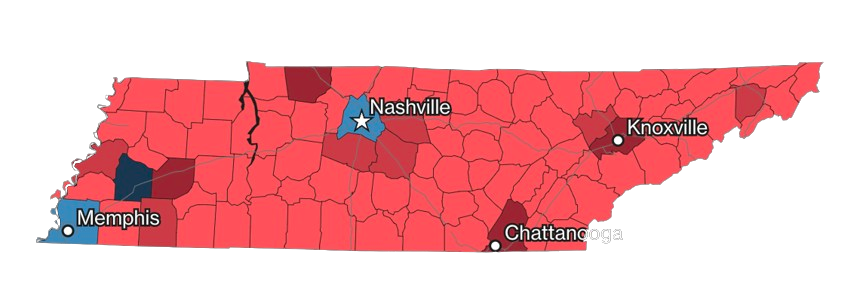
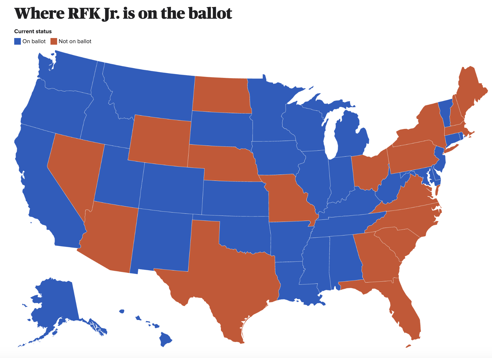
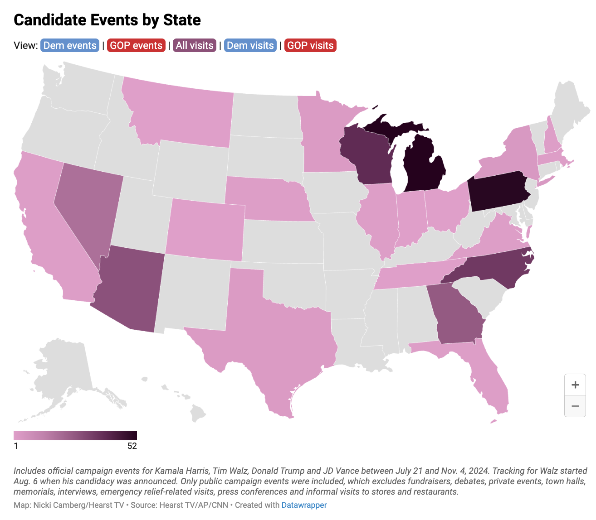

### Overview

}}index_files/figure-html/unnamed-chunk-2-1.png" width="672" />

To conclude my exploration of the 2024 US Presidential Election cycle, I will hone in on one state: Tennessee. The map above shows Tennessee and its 99 counties. The state is usually thought of through its three grand divisions (reflected in the three stars on the state flag). 

The three divisions are West, Middle and East Tennessee. West Tennessee is the most racially diverse of the grand divisions. West Tennessee includes Memphis, the largest city, in the bottom left of the state which is a democratic stronghold. Middle Tennessee includes several wealthy counties and another democratic stronghold in the middle of the state in Nashville. East Tennessee is home to a large rural population and includes the Appalachian Mountains. East Tennessee is also home to the cities of Knoxville and Chattanooga.

According to the recent [census](https://data.census.gov/profile/Tennessee?g=040XX00US47), Tennessee has a population of a little over 7 million. Racial minorities make up about 30% of the state's population with the largest minority group being African-Americans at 16%. Tennessee ranks toward the bottom of the country when it comes to [poverty](https://wisevoter.com/state-rankings/poverty-rate-by-state/) and [educational attainment](https://www.thecentersquare.com/tennessee/tennessee-ranks-among-the-least-educated-states-in-the-country/article_74e83f2f-23cc-5d98-82bb-060897d62c49.html) measurements

}}index_files/figure-html/unnamed-chunk-3-1.png" width="672" />

The map above shows the population of Tennessee's counties using Census 2022 estimates. The map highlights some of the cities mentioned earlier such as Memphis on the left, Nashville in the center, and Knoxville and Chattanooga in the East. 

In the 2024 cycle, Tennessee also featured some notable down ballot races. All nine of Tennessee's US House of Representative seats were up for election. The key down ballot race was for one of Tennessee's two senate seats. The race pitted the incumbent Marsha Blackburn (R) against Gloria Johnson (D). In Nashville, there was also an important referendum concerning a new transit plan. Overall, votes had more choices compared to last Presidential cycle. In [2024](https://www.thinktennessee.org/blog/2024-tennessee-elections-ran-smoothly-with-higher-early-voting-more-contested-races-approved-transit-vote-in-nashville/), 70.4% of races consisted of multiple candidates compared to 51.3% in 2020.

Tennessee's electoral history at the Presidential level is not complicated. The state is considered safely in the Republican column. The state has not been won by a Democrat since 1996 when Bill Clinton won and has not been contested since 2000 when Tennessee native Al Gore was running. In the 2016 and 2020 races, Trump cruised to victory with 60% of the vote.

### State Predictions vs. Outcome

The polling for Tennessee this cycle was extremely accurate to the actual outcome. The [polls from 538's aggregate](https://projects.fivethirtyeight.com/polls/tennessee/) predicted that Donald Trump would secure __62%__ of the vote while Kamala Harris would win __38%__. Similarly [The Hill and DecisionDesk HQ's](https://elections2024.thehill.com/tennessee/harris-trump-tennessee/) aggregate had Trump with __61.9% and Harris with 38.1%__. The map below shows the actual outcome fo the 2024 election by county in Tennessee. The final vote total had Donald Trump with __64%__ and Kamala Harris with __34%__. 

Why were the state predictions so accurate?

Before diving into why I think the state predictions are so accurate, it is important to note that very few polls were conducted on Tennessee voters. This is important when discussing accuracy, especially of an aggregate, because when more polls are introduced there is a higher likelihood that they are of lower quality and that decrease in quality may be the reason for the inaccuracy of the aggregate.

The major reason that polls were accurate in Tennessee is the simple fact that Tennessee is not a swing state. As mentioned earlier, Tennessee has not gone for the Democrats since 1996. This fact made it easier to predict Tennessee for the Republicans. Additionally, Tennessee is may be one of the safest red state' when considering vote margin. The state had the [third-largest Republican vote margin](https://www.foxnews.com/elections/2024/general-results/margin-of-victory) behind Florida and Texas.

Another reason for the high accuracy is the large early voting percentage in the 2024 election. [In 2024](https://www.thinktennessee.org/blog/2024-tennessee-elections-ran-smoothly-with-higher-early-voting-more-contested-races-approved-transit-vote-in-nashville/), 70% of the total votes cast in Tennessee for the President were cast early. This is more than the 67% in 2020 and the 64% in 2016. This increase in early voting can make polling more accurate because it could mean that more voters already had there mind made up before the election. The polls in Tennessee were probably capturing actual voting intention at a higher rate than states with lower early voting percentages. Additionally, the sample sizes for exit polls were higher due to the large early vote number. This could serve to make predictions more accurate too.

Although the polls were very close, they did slightly underestimate Trump and overestimate Harris. One reason for this could be the way Robert F. Kennedy Jr. was considered in the polling methodology. [As seen below](https://www.cbsnews.com/news/rfk-jr-map-on-the-ballot-states/) RFK Jr. dropped out of the 2024 Presidential race, but remained on the ballot in some states.

Notably, RFK Jr was on the ballot in Tennessee; however, he was not on the ballot in the majority of the pivotal seven swing states. It seems that the Tennessee polls did not account for RFK Jr. as the polls add up to 100%.

### Campaign

The analysis of what each campaign did in Tennessee during the 2024 election is limited. The analysis is limited due to the state's status as a safe state. Since the state is safe, neither campaign exerted much effort into the campaign in Tennessee. The map below shows the campaign stops made by both candidates from July 21, 2024 to November 4, 2024. As expected the majority of stops were in the swing states of Arizona, Georgia, Michigan, Pennsylvania, Nevada, North Carolina, and Wisconsin. According to the map below which uses data from [Hearst TV](https://www.wvtm13.com/article/candidate-tracker-nov-4/62796596), Tennessee only had one visit from a candidate.

 

  
Although the physical presence of both campaigns may have been muted, both campaigns had strong ties to Tennessee that could have influenced the votes of Tennesseans.

Donald Trump's campaign accounted for the one appearance by a candidate in the 2024 cycle. He also made it a point to visit Tennessee during his 2016 primary cycle. Trump extended his presence in the state by endorsing two candidates in hotly contested races, [Andy Ogles](https://nashvillebanner.com/2024/07/22/trump-endorses-andy-ogles/) and [Marsha Blackburn](https://www.marshablackburn.com/2024/07/29/trump-endorses-marsha-blackburn-for-re-election-a-friend-and-a-winner/). Andy Ogles was running for the US House seat that encompasses Nashville. Marsha Blackburn was running for reelection to the US Senate.

Kamala Harris' ties to the state stem from her term as Vice President. In 2022, the VP visited Tennessee to give a [commencement speech at Tennessee State University](https://www.whitehouse.gov/briefing-room/speeches-remarks/2022/05/07/remarks-by-vice-president-harris-at-the-tennessee-state-university-2022-spring-undergraduate-commencement-ceremony/), an HBCU in the heart of Nashville. This deepened her connection to the city and played on her background as an HBCU graduate. Harris is also connected to the state through the [Tennessee Three](https://www.bbc.com/news/world-us-canada-65182502. After three lawmakers were expelled from Tennessee's state legislature for protesting in favor of gun control laws, Harris was one of the first politicians to reach out. She once again returned to Tennessee to give a [speech at Fisk University](https://www.c-span.org/video/?c5065591/vp-harris-honors-tennessee-three-criticizes-tn-republicans-expulsion-members), another HBCU. One of the Tennessee Three, Gloria Johnson, was on the ballot alongside Harris as she ran for US Senate. Overall, Harris had strong support from Tennessee Democrats as they were the [first DNC delegations](https://wpln.org/post/tennessee-dnc-delegates-first-in-the-nation-to-back-kamala-harris/) to support her after Biden dropped out.

Trump's only appearance in Tennessee during campaign season was at a Bitcoin conference in Nashville in July. Although his speech at the conference was singularly focused on Bitcoin and not as expansive as a typical campaign rally speech, it can still be analyzed to see how the Trump campaign strategized.

In her work [The Message Matters](https://press.princeton.edu/books/paperback/9780691139630/the-message-matters?srsltid=AfmBOoqpmVvuPSpGmHSKaKxBt5JzFq_txE1DglKJcszEoHkum9SwMb5g), Lynn Vavreck details the concept of clarifying and insurgent campaigns. In her framework, a candidate should run a clarifying campaign if the economy is good and they are tied to the good economy. The reverse is true in that a candidate should run an insurgent campaign if the economy is bad and they are tied to the bad economy. To run a clarifying campaign, the candidate should emphasize the economy and in an insurgent campaign the candidate should highlight issues outside of the economy that the candidate has a strong track record on and public support behind. 

Using Vavreck's framework, Trump should have been emphasizing the economy in his campaign speeches. Below, I have created a word cloud using Trump's Bitcoin speech. After removing some filler words and common phrases like Bitcoin, the end result is below. In my opinion, the word cloud doesn't directly align with emphasizing the economy, but there are some words about the economy like inflation and tax.

}}index_files/figure-html/unnamed-chunk-7-1.png" width="672" />

Both campaign's weak ground game was combined with a weak air game. The amount of ads ran by each party were minimal. [According to the Wesleyan Media Project](https://mediaproject.wesleyan.edu/issues-sept24/), Tennessee had the 8th fewest amount of ads ran. Additionally, the ads that were ran in the state concentrated on two issues, immigration and inflation. This deviates from the swing states which received a larger breadth of issue ads. Unfortunately, the Wesleyan Media Project does not break down ads by party in each state, but since the focus was immigration and inflation the ads were probably ran by the GOP as they had more popular support on those issues.

This concludes my blog for the 2024 Election. Thank you for reading!
